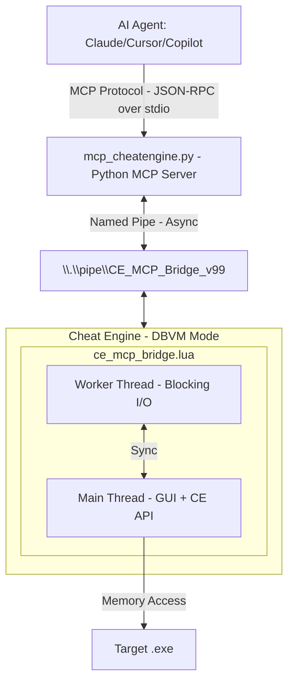

[Demo](https://github.com/user-attachments/assets/a184a006-f569-4b55-858a-ed80a7139035)

# Cheat Engine MCP Bridge

**Let multibillion $ AI datacenters analyze the program memory for you.**

Create mods, trainers, security audits, game bots, accelerate RE, or do anything else with any program and game in a fraction of a time.

[](#) [](https://python.org)

> [!NOTE]
> Thanks everyone for the stars, much appreciated! <3
> 
> Specially a big thank you to all the contributors!!
> 
> [@libangli218](https://github.com/libangli218), [@lauralex](https://github.com/lauralex), [@iamtyroon](https://github.com/iamtyroon)

---

## The Problem

You're staring at gigabytes of memory. Millions of addresses. Thousands of functions. Finding *that one pointer*, *that one structure* takes **days or weeks** of manual work.

**What if you could just ask?**

> *"Find the packet decryptor hook."*  
> *"Find the OPcode of character coordinates."*  
> *"Find the OPcode of health values."*  
> *"Find the unique AOB pattern to make my trainer reliable after game updates."*

**That's exactly what this does.**

_- Stop clicking through hex dumps and start having conversations with the memory._

---

## What You Get:

| Before (Manual) | After (AI Agent + MCP) |
|-----------------|---------------------|
| Day 1: Find packet address | Minute 1: "Find RX packet decryption hook" |
| Day 2: Trace what writes to it | Minute 3: "Generate unique AOB signature to make it update persistent" |
| Day 3: Find RX hook | Minute 6: "Find movement OPcodes" |
| Day 4: Document structure | Minute 10: "Create python interpreter of hex to plain text" |
| Day 5: Game updates, start over | **Done.** |

**Your AI can now:**
- Read any memory instantly (integers, floats, strings, pointers)
- Follow pointer chains: `[[base+0x10]+0x20]+0x8` → resolved in ms
- Auto-analyze structures with field types and values
- Identify C++ objects via RTTI: *"This is a CPlayer object"*
- Disassemble and analyze functions
- Debug invisibly with hardware breakpoints + Ring -1 hypervisor
- And much more!

---

## How It Works

---

## Installation

```bash
pip install -r MCP_Server/requirements.txt
```
Or manually:
```bash
pip install mcp pywin32
```

> [!NOTE]
> Native pipe mode is **Windows only** because it uses Named Pipes (`pywin32`). Use TCP relay transport when the MCP server runs outside the Windows environment that hosts Cheat Engine and cannot open the named pipe directly.

---

## Quick Start

### 1. Load Bridge in Cheat Engine
1. Enable DBVM in Cheat Engine if you plan to use DBVM tools.
2. Open Cheat Engine's Lua Engine or script executor.
   - Preferred: `File` -> `Execute Script` -> open `MCP_Server/ce_mcp_bridge.lua` -> `Execute`.
   - If your Cheat Engine build does not show `File` -> `Execute Script`, use `Table` -> `Show Cheat Table Lua Script`, paste the `dofile(...)` line below, and execute it:

```lua
dofile([[C:\path\to\cheatengine-mcp-bridge\MCP_Server\ce_mcp_bridge.lua]])
```

Look for: `[MCP v12.0.0] MCP Server Listening on: CE_MCP_Bridge_v99`

### 2. Configure MCP Client
Add to your MCP configuration (e.g., `mcp_config.json`):
```json
{
  "servers": {
    "cheatengine": {
      "command": "python",
      "args": ["C:/path/to/MCP_Server/mcp_cheatengine.py"]
    }
  }
}
```
Restart the IDE to load the MCP server config.

For Codex, add a TOML server block to `~/.codex/config.toml`:

```toml
[mcp_servers.cheatengine]
command = "python"
args = ['C:\path\to\cheatengine-mcp-bridge\MCP_Server\mcp_cheatengine.py']
```

Use single quotes for the Windows path so TOML treats backslashes literally.

#### TCP relay transport

The TCP relay lets `mcp_cheatengine.py` talk to Cheat Engine through a TCP socket instead of opening the Windows named pipe itself. Cheat Engine and the Lua bridge still run on Windows, while the MCP server can run anywhere that can reach the relay: another Windows process, a VM, a container, a Linux host, or a remote machine. This can also be used with WSL without changing the Lua bridge.

1. On Windows, load `MCP_Server/ce_mcp_bridge.lua` in Cheat Engine as usual.
2. On Windows, start the relay:

```powershell
python C:\path\to\cheatengine-mcp-bridge\MCP_Server\ce_tcp_relay.py --host 127.0.0.1 --port 9876
```

3. In the environment where the MCP server will run, install the MCP dependency without `pywin32`, then run/configure the MCP server with TCP transport:

```bash
python3 -m pip install -r MCP_Server/requirements-tcp.txt
```

```bash
CE_MCP_TRANSPORT=tcp \
CE_MCP_HOST=127.0.0.1 \
CE_MCP_PORT=9876 \
python3 /path/to/cheatengine-mcp-bridge/MCP_Server/mcp_cheatengine.py
```

For MCP client configs that support environment variables:

```json
{
  "servers": {
    "cheatengine": {
      "command": "python3",
      "args": ["/path/to/cheatengine-mcp-bridge/MCP_Server/mcp_cheatengine.py"],
      "env": {
        "CE_MCP_TRANSPORT": "tcp",
        "CE_MCP_HOST": "127.0.0.1",
        "CE_MCP_PORT": "9876"
      }
    }
  }
}
```

Set `--host` on the relay and `CE_MCP_HOST` on the MCP server to addresses that match your network setup. Keep the relay bound to trusted interfaces only, because anyone who can reach it can control the Cheat Engine bridge.

### 3. Verify Connection
Use the `ping` tool to verify connectivity:
```json
{"success": true, "version": "12.0.0", "message": "CE MCP Bridge Active"}
```

### 4. Start Asking Questions
```
"What process is attached?"
"Read 16 bytes at the base address"
"Disassemble the entry point"
```

---

## ~180 MCP Tools Available

### Memory
| Tool | Description |
|------|-------------|
| `read_memory`, `read_integer`, `read_string` | Read any data type |
| `read_pointer_chain` | Follow `[[base+0x10]+0x20]` paths |
| `scan_all`, `aob_scan` | Find values and byte patterns |

### Analysis
| Tool | Description |
|------|-------------|
| `disassemble`, `analyze_function` | Code analysis |
| `dissect_structure` | Auto-detect fields and types |
| `get_rtti_classname` | Identify C++ object types |
| `find_references`, `find_call_references` | Cross-references |

### Debugging
| Tool | Description |
|------|-------------|
| `set_breakpoint`, `set_data_breakpoint` | Hardware breakpoints |
| `start_dbvm_watch` | Ring -1 invisible tracing |

### Process Lifecycle
| Tool | Description |
|------|-------------|
| `open_process`, `get_process_list` | Attach to or enumerate running processes |
| `create_process` | Launch a new process under CE's control |
| `pause_process`, `unpause_process` | Suspend / resume target execution |

### Memory Allocation
| Tool | Description |
|------|-------------|
| `allocate_memory`, `free_memory` | Reserve and release memory in the target |
| `set_memory_protection`, `full_access` | Adjust page protection flags |

### Code Injection
| Tool | Description |
|------|-------------|
| `inject_dll` | Load a DLL into the target process |
| `execute_code`, `execute_method` | Run shellcode or CE Lua methods remotely |

### Symbol Management
| Tool | Description |
|------|-------------|
| `register_symbol`, `get_symbol_info` | Create and query named symbols |
| `enable_windows_symbols` | Enable PDB symbol resolution |

### Assembly / Compilation
| Tool | Description |
|------|-------------|
| `assemble_instruction` | Assemble a single x86/x64 instruction to bytes |
| `compile_c_code` | Compile C source into injected shellcode |
| `generate_api_hook_script` | Generate a CE auto-assembler API hook template |

### Window / GUI Automation
| Tool | Description |
|------|-------------|
| `find_window` | Locate a window by title or class |
| `send_window_message` | Post `WM_*` messages to a target window |

### Input Automation
| Tool | Description |
|------|-------------|
| `get_pixel` | Sample a pixel color at screen coordinates |
| `is_key_pressed`, `do_key_press` | Query and simulate keyboard input |

### Cheat Table
| Tool | Description |
|------|-------------|
| `load_table`, `save_table` | Load / save `.CT` cheat table files |
| `get_address_list` | Enumerate entries in the active cheat table |

### Kernel Mode (DBK / DBVM)
| Tool | Description |
|------|-------------|
| `dbk_get_cr3` | Read the CR3 register for the target process |
| `read_process_memory_cr3` | Read physical memory via CR3 bypass |

And many more at `AI_Context/MCP_Bridge_Command_Reference.md`

---

## Critical Configuration

### BSOD Prevention
> [!CAUTION]
> **You MUST disable:** Cheat Engine → Settings → Extra → **"Query memory region routines"**
> 
> Enabled: Causes `CLOCK_WATCHDOG_TIMEOUT` BSODs due to conflicts with DBVM/Anti-Cheat when scanning protected pages.

---

## Troubleshooting

### Cheat Engine says "too many local variables"

Load the bridge from disk with `dofile(...)` instead of pasting the full script into a cheat table script. The bridge also declares command handlers as global functions intentionally; this avoids Cheat Engine's Lua chunk limit of 200 local variables when the complete bridge is compiled at once.

### MCP client cannot connect

Check these in order:

1. Cheat Engine is open and shows `MCP Server Listening on: CE_MCP_Bridge_v99`.
2. The MCP client was restarted after adding the server config.
3. The configured `mcp_cheatengine.py` path exists.
4. `pip install -r MCP_Server/requirements.txt` has installed both `mcp` and `pywin32`.
5. Run the MCP `ping` tool. A successful connection returns `success: true` and the bridge version. `process_id: 0` is normal until Cheat Engine is attached to a target process.

---

## Environment Variables

| Variable | Default | Purpose |
|----------|---------|---------|
| `CE_MCP_TIMEOUT` | `30` | Timeout (seconds) for each MCP tool call. |
| `CE_MCP_ALLOW_SHELL` | *unset* | Set to `1` to enable `run_command` / `shell_execute` tools. **Arbitrary code execution risk** — leave unset by default. |

---

## Example Workflows

**Finding a value:**
```
You: "Scan for gold: 15000"  →  AI finds 47 results
You: "Gold changed to 15100"  →  AI filters to 3 addresses
You: "What writes to the first one?"  →  AI sets hardware BP
You: "Disassemble that function"  →  Full AddGold logic revealed
```

**Understanding a structure:**
```
You: "What's at [[game.exe+0x1234]+0x10]?"
AI: "RTTI: CPlayerInventory"
AI: "0x00=vtable, 0x08=itemCount(int), 0x10=itemArray(ptr)..."
```

---

## Project Structure

```
CLAUDE.md                               # Claude Code agent guidance (this repo)
README.md                               # User-facing documentation

MCP_Server/
├── mcp_cheatengine.py                  # Python MCP Server (FastMCP)
├── ce_mcp_bridge.lua                   # Cheat Engine Lua Bridge
└── test_mcp.py                         # Test Suite

AI_Context/
├── BATCH_WORKER_BRIEFING.md            # Parallel-worker task specifications (v12 overhaul)
├── MCP_Bridge_Command_Reference.md     # MCP Commands reference
├── CE_LUA_Documentation.md             # Full CheatEngine 7.6 official documentation
└── AI_Guide_MCP_Server_Implementation.md  # Full technical documentation for AI agent
```

---

## Testing

Running the test:
```bash
python MCP_Server/test_mcp.py
```

Expected output:
```
✅ Memory Reading: 6/6 tests passed
✅ Process Info: 4/4 tests passed  
✅ Code Analysis: 8/8 tests passed
✅ Breakpoints: 4/4 tests passed
✅ DBVM Functions: 3/3 tests passed
✅ Utility Commands: 11/11 tests passed
⏭️ Skipped: 1 test (generate_signature)
────────────────────────────────────
Total: 36/37 PASSED (100% success)
```

---

## The Bottom Line

You no longer need to be an expert. Just ask the right questions.

⚠️ EDUCATIONAL DISCLAIMER

This code is for educational and research purposes only. It's created to show the capabilities of the Model Context Protocol (MCP) and LLM-based debugging. I do not condone the use of these tools for malicious hacking, cheating in multiplayer games, or violating Terms of Service. This is a demonstration of software engineering automation.
